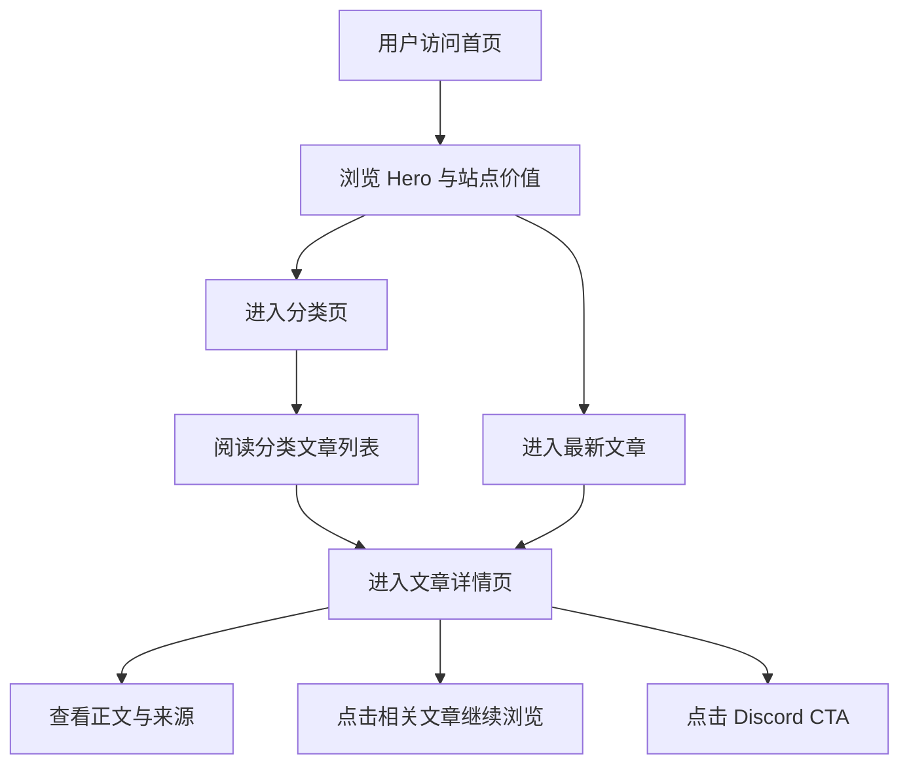

## 1. 产品概述
求职生存指南站是一个面向 2026 年欧美求职者的静态内容网站，帮助被裁科技从业者、担忧 AI 替代的职场人和焦虑中的毕业生快速获得可执行的求职策略。
- 产品聚焦于 AI 求职策略、职业转型、求职心理和面试通关四大板块，以高质量英文长文和清晰导航降低信息过载。
- 产品价值在于把分散、情绪化、噪声大的求职信息整理成可搜索、可阅读、可转化的结构化指南站点。

## 2. 核心功能

### 2.1 功能模块
1. **首页**：Hero 文案、四大板块入口、最新文章列表、站点级 CTA。
2. **分类页**：分类 Hero、分类说明、文章列表。
3. **文章详情页**：面包屑、文章正文、标签、来源列表、相关文章、Discord CTA。
4. **SEO 与站点发现能力**：动态 metadata、robots、sitemap、404 与错误页。

### 2.2 页面详情
| 页面名称 | 模块名称 | 功能描述 |
|-----------|-----------|-----------|
| 首页 | Hero 区域 | 用高冲击力标题说明 2026 求职环境和站点价值，提供跳转到最新内容与社区 CTA |
| 首页 | 分类概览 | 展示四个核心板块的定位、入口和视觉区分 |
| 首页 | 最新文章 | 展示近期重点文章，显示发布日期与阅读时长 |
| 分类页 | 分类 Hero | 解释当前板块关注问题、适合人群与阅读收益 |
| 分类页 | 文章列表 | 按分类呈现文章卡片，支持用户快速筛选阅读方向 |
| 文章页 | 面包屑 | 显示首页、分类、当前文章路径 |
| 文章页 | 内容主体 | 渲染结构化段落、步骤列表、检查清单和引用说明 |
| 文章页 | 来源区 | 文末展示来源机构和外链，匹配正文内引用 |
| 文章页 | 相关文章 | 推荐同分类或语义接近的文章 |
| 全站 | Header / Footer | 提供主导航、分类高亮、辅助导航与社区引导 |
| 全站 | SEO 文件 | 生成静态 robots 与 sitemap，改善搜索收录 |

## 3. 核心流程
用户进入首页后，会先理解当前求职环境，再从分类入口或最新文章中进入具体主题。阅读文章时，用户通过面包屑和相关文章在站内继续浏览，并在文末通过社区 CTA 获得更进一步支持。

## 4. 用户界面设计

### 4.1 设计风格
- 主色调：深灰黑背景，辅以 emerald 与 cyan 的渐变强调色
- 按钮风格：中等圆角、细边框、轻微发光与渐变背景
- 字体策略：标题高字重无衬线，正文使用易读英文无衬线字体
- 布局风格：移动端优先，桌面端使用受控宽度阅读列与卡片网格
- 图标风格：统一使用 `lucide-react`，线性、克制、信息导向
- 背景细节：低对比度网格纹理、浅渐变光晕、边框高亮而非厚重阴影

### 4.2 页面设计概览
| 页面名称 | 模块名称 | UI 元素 |
|-----------|-----------|-----------|
| 首页 | Hero 区域 | 深色渐变背景、粗体标题、说明文本、主次 CTA、背景网格 |
| 首页 | 分类概览 | 4 列或 2 列卡片网格、分类图标、短描述、悬浮态高亮 |
| 首页 | 最新文章 | 文章卡片、日期、阅读时长、标签 |
| 分类页 | 分类 Hero | 分类标题、说明文案、板块图标、强调色边框 |
| 分类页 | 文章列表 | 统一 Guide Card 卡片、层级分明、适配移动端 |
| 文章页 | 内容主体 | 控制阅读宽度、标题层级、段落、清单、引用区块 |
| 文章页 | 相关文章 | 横向或纵向文章卡片区，与正文视觉分层 |
| 404 / Error | 状态页 | 简短说明、返回首页按钮、浏览分类入口 |

### 4.3 响应式
- 移动端优先设计，首页与分类页在窄屏采用单列或双列卡片
- 平板和桌面端增强留白、版心宽度和多列布局
- 所有 CTA、导航、文章元信息在触屏环境下保持可点击面积
