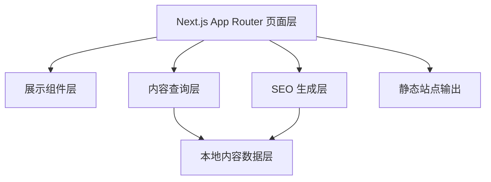
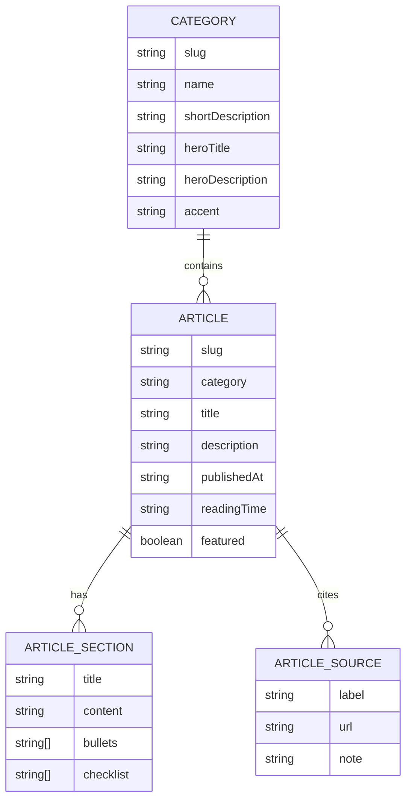

## 1. 架构设计

本站采用纯前端静态内容架构，不引入独立后端或外部数据库。页面层通过 `lib/content` 中的本地数据和查询函数完成分类、文章、相关文章与 metadata 派生，最终通过 `output: 'export'` 导出静态文件。

## 2. 技术说明
- 前端框架：`Next.js 16+` + `React` + `TypeScript`
- 样式系统：`TailwindCSS v4`
- 图标库：`lucide-react`
- 内容来源：本地 TypeScript 数据文件
- 部署方式：`Vercel`
- 输出模式：静态导出 `output: 'export'`
- 统计方案：本阶段不接入 `GA4`

## 3. 路由定义
| 路由 | 用途 |
|------|------|
| `/` | 首页，展示 Hero、分类入口和最新文章 |
| `/ai-job-search` | AI 求职策略分类页 |
| `/career-pivot` | 职业转型分类页 |
| `/job-search-mindset` | 求职心理分类页 |
| `/interview-prep` | 面试通关分类页 |
| `/articles/[slug]` | 文章详情页 |
| `/robots.txt` | 搜索引擎抓取规则 |
| `/sitemap.xml` | 搜索引擎站点地图 |
| `/404` | 静态 404 页面 |

## 4. API 定义
本项目不包含后端 API。内容读取全部来自本地静态数据，避免运行时依赖，确保与静态导出兼容。

## 5. 数据模型

### 5.1 数据模型定义

### 5.2 TypeScript 数据定义
- `Category`：保存分类 slug、名称、描述、视觉强调色与展示文案
- `Article`：保存文章基础信息、标签、结构化 sections、CTA 与来源列表
- `ArticleSection`：支持段落、列表、检查清单等内容块
- `ArticleSource`：支持文末来源区输出与正文内引用映射

## 6. 模块设计
- `lib/content/types.ts`：定义内容模型类型
- `lib/content/data.ts`：维护分类数据、首页 Hero 文案和文章数据
- `lib/content/queries.ts`：提供获取分类、文章、最新文章、相关文章的纯函数
- `lib/content/seo.ts`：统一生成首页、分类页和文章页 metadata
- `components/*`：负责展示，不直接访问原始数据文件
- `app/*`：负责路由、静态参数生成和页面级数据组合

## 7. 静态导出策略
- 使用 `generateStaticParams()` 为分类页和文章页生成所有静态路径
- 不在页面中使用依赖运行时服务端的数据请求
- `robots.ts` 和 `sitemap.ts` 基于本地数据静态生成
- 不使用需要 Node 运行时的动态 API Route

## 8. 错误处理策略
- 非法分类 slug 通过 `notFound()` 返回分类级 404
- 非法文章 slug 通过 `notFound()` 返回文章级 404
- 全局渲染异常由 `app/error.tsx` 承接
- 查询函数返回空值或空数组，不在数据层抛业务异常

## 9. 测试与验证策略
- 运行类型检查与构建检查，验证静态导出可成功完成
- 为内容查询函数补充少量高价值测试，覆盖排序、过滤和相关文章逻辑
- 验证首页、分类页、文章页、404、robots、sitemap 的输出结果
- 使用浏览器或预览链接检查视觉层级、导航可用性和响应式表现
